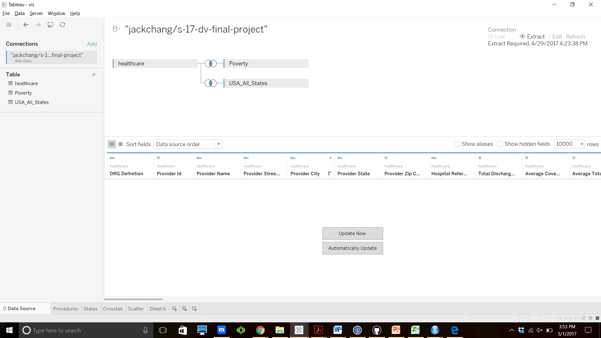
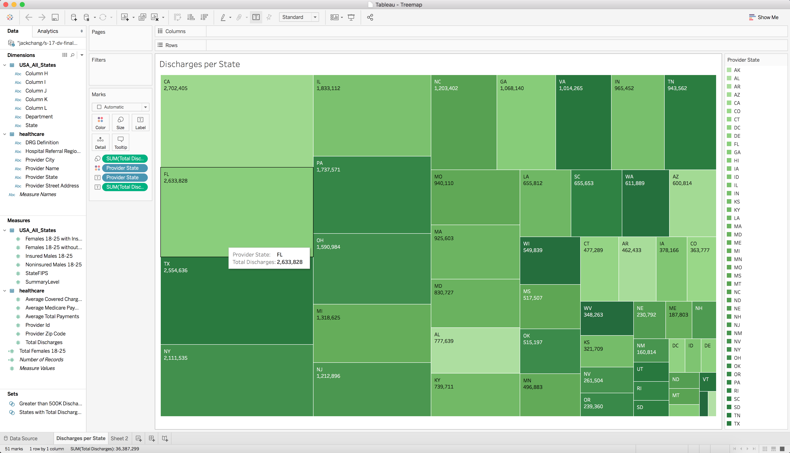

```{r sessionInfo}
sessionInfo(package=NULL)
```

#**Introduction**
This is the webpage for our project number 4. We are now using Tableau Actions and Shiny Actions to add context and interactivity to our data. The Shiny Actions visualization can be found on Jack's Shiny account. 

#**Data Clean-up**
This code generates a post-ETL csv for our healthcare data into our CSV folder. You can find it in our S17 DV Final Project dataset on data.World and download it by clicking the download button one the healthcare.csv file!
```{r}
source("../01 Data/ETL_healthcare.R")
```
#**Joining**
We joined our healthcare.csv with the census data keyed on states using Tableau. We wanted to see how many young males and females are insured in each of these states, and could do so by looking at our joined data, called healthcare_census.csv. We downloaded this data and uploaded to our data.world. We then created visualizations pulling this joined dataset from data.world.




#**Graph 1**
This first visual is a crosstab which joins 3 different datasets related to healchare throughout the US. The crosstab shows the cost per discharge in the 5 least insured states within the US. It includes different sets to organize the data as well as a KPI of cost per discharge with three different parameters: high, medium, and low.


Here is the Shiny link: https://jackchang.shinyapps.io/insratebarchart/


#**Graph 2**

This bargraph selectively shows the sum of the average total payments per year of the different heart disease procedures from 3 most populous states and the 3 least populous states. We can use the state and Diagnosis Related Group (DRG) filters to adjust the Bargraph as we like while also using ID sets to create different kinds of sets from the heart procedures.


Here is the Shiny link: https://jackchang.shinyapps.io/inskpi/


#**Graph 3**
This visual is a treemap which shows the total annual number of discharges per state KPI. This treemap helps understand what to expect from different facets of our healthcare data, including which states should insure the most/least people, which states should have the highest payments, and much more. Ultimately this visual serves to give a more general understanding of such a large collection of data.




Here is the Shiny link: https://traj30.shinyapps.io/graph3/


#**Graph 4**
This bargraph joins data from 2 of our datasets, USA_All_Healthcare.csv and healthcare.csv to show the percentage of females insured per state versus the percentage of males insured per state. More specifically, rather than showing the actual percentage of each gender, the visual compares each state's female and male insured percentage to the national average of each gender's insured percentage.


