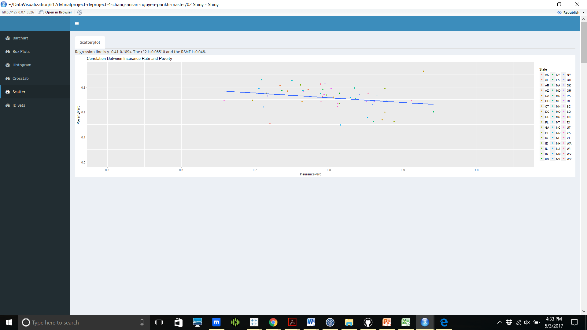

<center></center>

#**Introduction**
This is the webpage for our final project. Using what we've learned throughout the semester, we created various visualizations all while using techniques such as joins via Tableau and Shiny. The Shiny application visualizations can be found on Jack's Shiny account which you can navigate to by clicking this link: https://jackchang.shinyapps.io/finproj1/ 

#**R Configuration**
Below is our R session info.
```{r sessionInfo}
sessionInfo(package=NULL)
```

#**Data Clean-up**
This code generates a post-ETL csv for our healthcare data into our CSV folder. You can find it in our S17 DV Final Project dataset on data.world and download it by clicking the download button one the healthcare.csv file!
```{r}
source("../01 Data/ETL_healthcare.R")
```

#**Joining**
We joined our healthcare.csv with the census data keyed on states using Tableau. We wanted to see how many young males and females are insured in each of these states, and could do so by looking at our joined data. We also joined this merged dataset to a dataset named Poverty, which has information on number of people in and out of poverty in each state. The following png shows the join in Tableau. We did the same join using SQL for our Shiny App. 


#**Graph 1: Crosstab**
This first visual is a crosstab which joins all 3 of our datasets (which are related to healchare) throughout the US. The crosstab shows the cost per discharge in the 5 least insured states. It includes different sets to organize the data as well as a KPI of cost per discharge with three different parameters: high, medium, and low.


#**Graph 2: Barchart with ID Sets**
This bargraph selectively shows the sum of the average total payments per year of the different heart disease procedures from 3 most populous states and the 3 least populous states. We can use the state and Diagnosis Related Group (DRG) filters to adjust the Bargraph as we like while also using ID sets to create different kinds of sets from the heart procedures.


#**Graph 3: Treemap/Histogram**
This visual is a treemap which shows the total annual number of discharges per state KPI. This treemap helps understand what to expect from different facets of our healthcare data, including which states should insure the most/least people, which states should have the highest payments, and much more. Ultimately this visual serves to give a more general understanding of such a large collection of data.


Here is a histogram from shiny showing the same concept:


#**Graph 4: Barchart with Table Calculation**
This bargraph joins data from 2 of our datasets, USA_All_Healthcare.csv and healthcare.csv to show the percentage of females insured per state versus the percentage of males insured per state. More specifically, rather than showing the actual percentage of each gender, the visual compares each state's female and male insured percentage to the national average of each gender's insured percentage.


#**Graph 5: Scatterplot**
This scatter joins all 3 of our datasets: Poverty.csv, USA_All_States.csv, and healthcare.csv and shows the how the percentage of poverty as a function of percentage of people insured per state. Here we see a general trend that explains that as percentage of people insured per state increases, the percentage of poverty decreases. In other words, these two variables are negatively correlated.





#**Graph 6: Map**
This map joins Poverty.csv and healthcare.csv. A KPI was created which creates a ratio of the number of youth (18-24) below the poverty line over the total number of people below poverty line. When certain states are chosen, an action will open up a bar chart which will compare that KPI between different states. 


Below is the result of the action after selecting some of the mountain states:


#**Graph 7: BoxPlot**
This boxplot shows the average and quartile information for average medicare payment in each state. The color is keyed by insurance rate and the sorted from left to right.  This is interesting in that it looks like the states with the highest median payment also tend to have the highest insurance rates.


